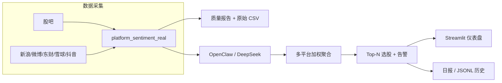

# OpinionTradingWorkflow

**多平台舆情采集 · LLM 情感分析 · 实时选股 · 可解释投研仪表盘**

Python 个人项目：从股吧、新浪财经、微博、东方财富、雪球、抖音等渠道抓取舆情，经 OpenClaw + DeepSeek 打分后聚合为选股信号，并通过 Streamlit 展示 Top 排名、评论证据链与回测结果。

> 适合作为 **数据工程 / 量化研究 / AI 应用** 方向的个人作品展示。

---

## 项目亮点（简历可写）

- **端到端流水线**：采集 → 清洗/质检 → LLM 情感打分 → 多平台加权聚合 → 实时 Top-N 选股 → 日报 & 告警
- **真实 LLM 集成**：OpenClaw Gateway + WebSocket→HTTP 代理，对接 **DeepSeek V4 Flash**（云端 API，单轮 realtime ~9 分钟）
- **可解释输出**：每条选股附带各平台分项得分；UI「评论依据」Tab 展示正/负评论原文摘录
- **数据质量闭环**：自动生成质量报告（标题/时间/正文覆盖率、噪声率），按平台拆分原始 CSV 作为证据链
- **工程化细节**：Stub 兜底保证演示可复现；`OPENCLAW_SKIP_ROW_SCORE` 控制 LLM 调用量；Windows 一键脚本 + CI 测试

---

## 技术栈

| 类别 | 技术 |
|------|------|
| 语言 / 运行时 | Python 3.12 |
| 数据采集 | requests + 自定义 HTML 解析（6 平台） |
| LLM | OpenClaw Gateway、DeepSeek API、自研 WS 代理 |
| 数据处理 | pandas、JSONL 持久化 |
| 可视化 | Streamlit、Altair |
| 行情 | akshare（含本地缓存回退） |
| 测试 / CI | pytest、GitHub Actions |

---

## 系统架构



---

## 示例产出

**实时选股**（`data/reports/realtime_picks_20260602_225443.md`）：

| 排名 | 代码 | 综合得分 | 平台分项 |
|------|------|---------|---------|
| #1 | 601318.SH | +0.036 | sina +0.30, weibo −0.10 |
| #2 | 600519.SH | +0.030 | sina +0.50, eastmoney −0.20 |
| #3 | 000001.SZ | −0.131 | sina −0.70 |

**数据质量**（`data/reports/quality_2026-06-02.md`）：38 条原始帖，Overall **PASS**（标题/时间/正文覆盖率 100%）。

---

## 快速开始

### 环境准备

```powershell
git clone https://github.com/yixi1951/OpinionTradingWorkflow.git
cd OpinionTradingWorkflow
python -m venv .venv
.\.venv\Scripts\Activate.ps1
pip install -r requirements.txt
```

### 一键打开分析网页（推荐）

自动检测是否有选股数据；若无则先跑 Stub 演示，再启动 Streamlit 并打开浏览器：

```powershell
powershell -ExecutionPolicy Bypass -File .\scripts\run_ui.ps1
```

已有数据、仅启动 UI：

```powershell
powershell -ExecutionPolicy Bypass -File .\scripts\run_ui.ps1 -NoBrowser
```

浏览器访问 http://localhost:8501 ，四个 Tab：**实时选股 · 舆情分析 · 评论依据 · 回测评估**。

### 方式 A：Stub 演示（~2 分钟，无需 API）

```powershell
powershell -ExecutionPolicy Bypass -File .\scripts\run_demo.ps1
```

### 方式 B：真实 OpenClaw + DeepSeek（~10 分钟）

**前置**：安装 [OpenClaw](https://www.npmjs.com/package/openclaw)，运行 `openclaw configure` 配置 DeepSeek API Key。

```powershell
# 一键：启动 gateway + HTTP 代理 + 冒烟测试 + daily/realtime
powershell -ExecutionPolicy Bypass -File .\scripts\run_demo_openclaw.ps1 -WithUI
```

脚本会自动读取 `%USERPROFILE%\.openclaw\openclaw.json` 中的 token 与默认模型（`deepseek/deepseek-v4-flash`）。

仅测连通、跳过 realtime：

```powershell
powershell -ExecutionPolicy Bypass -File .\scripts\run_demo_openclaw.ps1 -SkipRealtime
```

**手动分步**（可选）：

```powershell
# 终端 1
openclaw gateway run --port 18789 --force

# 终端 2
$env:WS_GATEWAY_URL = "ws://127.0.0.1:18789"
$env:WS_GATEWAY_TOKEN = "<your-token>"          # 见 openclaw.json
$env:WS_GATEWAY_MODEL = "deepseek/deepseek-v4-flash"
$env:WS_GATEWAY_RESPONSE_TIMEOUT = "90"
python -m uvicorn openclaw_ws_proxy:app --host 127.0.0.1 --port 18790

# 终端 3
$env:OPENCLAW_URL = "http://127.0.0.1:18790"
$env:OPENCLAW_TIMEOUT = "90"
$env:OPENCLAW_SKIP_ROW_SCORE = "1"
python run_pipeline.py --mode realtime --iterations 1 --top-n 3
```

### 仪表盘四个 Tab

| Tab | 内容 |
|-----|------|
| 实时选股 | Top 3 卡片、分级告警、选股原因 |
| 舆情分析 | 情感趋势、平台贡献、雷达图 |
| 评论依据 | 正/负评论摘录（证据链） |
| 回测评估 | 信号准确率、Sharpe、月度训练 |

---

## 主要命令

```powershell
# 日报流水线
python run_pipeline.py --mode daily --date 2026-06-02

# 实时选股（需 OPENCLAW_URL）
python run_pipeline.py --mode realtime --iterations 1 --top-n 3

# 回测 / 评估
python run_pipeline.py --mode backtest --start-date 2025-01-01 --end-date 2025-12-31
python run_pipeline.py --mode evaluate

# 测试
pytest -q
```

---

## 目录结构

```
├── run_pipeline.py              # CLI 入口
├── openclaw_ws_proxy.py         # WebSocket → REST 代理
├── openclaw_stub.py             # 本地 Stub（无 API 可演示）
├── config/settings.yaml         # 平台权重、股票池、阈值
├── scripts/
│   ├── run_ui.ps1               # 一键打开 Streamlit 分析页
│   ├── run_demo.ps1             # Stub 一键演示
│   ├── run_demo_openclaw.ps1    # OpenClaw 一键演示
│   └── text_quality.py          # 噪声/ boilerplate 过滤
├── src/opinion_trading/
│   ├── agents/workflow.py       # 多智能体编排
│   ├── integrations/            # 真实/Stub 平台采集
│   ├── core/                    # 配置、存储、回测、OpenClaw 适配
│   └── ui_dashboard.py          # Streamlit 仪表盘
├── data/reports/                # 日报、选股、质量报告（示例已提交）
└── tests/                       # 单元测试
```

---

## 配置说明

`config/settings.yaml` 核心项：

- **universe.symbols**：股票池（默认 600519.SH、000001.SZ、601318.SH）
- **strategy.platform_weights**：各平台权重（股吧 1.40、东财 1.30 …）
- **strategy.bullish_threshold / bearish_threshold**：多空信号阈值

环境变量：

| 变量 | 说明 |
|------|------|
| `OPENCLAW_URL` | OpenClaw HTTP 地址（代理或 stub） |
| `OPENCLAW_TIMEOUT` | 单次 LLM 超时秒数（默认 90） |
| `OPENCLAW_SKIP_ROW_SCORE` | `1` = 跳过逐帖打分，仅聚合层调用 LLM |

---

## 已知局限

- 部分平台受反爬影响，会有 `fallback` 行；质量报告可追踪
- 股吧噪声率偏高，持续优化 `text_quality.py` 规则
- 当前股票池为 3 只 A 股样板；扩展只需改 `settings.yaml`
- ML 基线（TF-IDF + LinearSVC）已搭建，标注样本量尚小，指标仅供参考

---

## 更多文档

- [新手教程](docs/beginner_tutorial_zh.md)
- [项目简介](docs/brief_intro_zh.md)
- [标注说明](docs/annotation_instructions_zh.md)（可选 ML 验证线）

---

## License

MIT（或个人学习用途，请按需调整）
