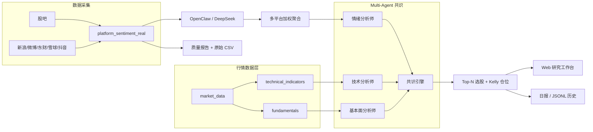

# OpinionTradingWorkflow

[](https://github.com/yixi1951/OpinionTradingWorkflow/actions/workflows/ci.yml)
[](https://github.com/yixi1951/OpinionTradingWorkflow/actions)
[](https://www.python.org/)
[](LICENSE)
[](https://github.com/yixi1951/OpinionTradingWorkflow/commits/main)

**多平台舆情采集 · LLM 情感分析 · 多 Agent 评分 · 实时选股 · 可解释投研仪表盘**

Python 个人项目：从股吧、新浪财经、微博、东方财富、雪球、抖音等渠道抓取舆情，经 OpenClaw + DeepSeek 打分后聚合为研究信号，并通过 **Multi-Agent 评分架构**（情绪 + 技术面 + 基本面 → 加权共识）综合研判，最终通过同源 Web 研究工作台展示排名、评论证据链与回测结果。

> 适合作为 **数据工程 / 量化研究 / AI 应用** 方向的个人作品展示。

### Web 研究工作台预览

<!-- 将截图保存为 docs/assets/dashboard-hero.png 后取消下一行注释 -->
<!--  -->

*正式入口：运行 `scripts/run_ui.ps1`，访问 `http://localhost:8000`。*

---

## 项目质量

| 指标 | 数值 |
|------|------|
| 测试用例 | **120+**（单元 + 集成 + 多 Agent 评分验证） |
| 代码覆盖 | **44%**（核心模块 60-97%，前端以独立构建和 API 合约验证） |
| 分析师 Agent | **3 个**（情绪 / 技术 / 基本面）+ 共识引擎 |
| 行情数据 | yfinance → akshare 双回退 + Parquet 缓存 |
| CI pipeline | ruff lint → black 格式 → mypy 类型 → pytest + 覆盖率门槛 → 报告上传 |
| 支持 Python | 3.10 / 3.11 / 3.12 |
| 预提交钩子 | ruff (fix+fmt)、black、mypy、trailing-whitespace、end-of-file-fixer 等 |


- **端到端流水线**：采集 → 清洗/质检 → LLM 情感打分 → 多平台加权聚合 → 实时 Top-N 选股 → 日报 & 告警
- **Multi-Agent 评分架构**：情绪分析师（6 平台聚合）+ 技术分析师（RSI/MACD/布林带/成交量）+ 基本面分析师（PE/ROE/营收增长/Beta）→ **共识引擎加权融合 + Kelly 仓位管理**
- **行情数据层**：yfinance → akshare 三级回退，Parquet 本地缓存（TTL=4h），自动处理 A 股代码映射
- **真实 LLM 集成**：OpenClaw Gateway + WebSocket→HTTP 代理，对接 **DeepSeek V4 Flash**（云端 API，单轮 realtime ~9 分钟）
- **可解释输出**：每条选股附带各分析师分项得分和看多看空辩论摘要；UI「评论依据」Tab 展示正/负评论原文摘录
- **数据质量闭环**：自动生成质量报告（标题/时间/正文覆盖率、噪声率），按平台拆分原始 CSV 作为证据链
- **工程化细节**：Stub 兜底保证演示可复现；`OPENCLAW_SKIP_ROW_SCORE` 控制 LLM 调用量；Windows 一键脚本 + CI 测试

---

## 技术栈

| 类别 | 技术 |
|------|------|
| 语言 / 运行时 | Python 3.12 |
| 数据采集 | requests + 自定义 HTML 解析（6 平台） |
| LLM | OpenClaw Gateway、DeepSeek API、自研 WS 代理 |
| 数据处理 | pandas、NumPy、PyArrow (Parquet)、JSONL 持久化 |
| 可视化 | Vite、React、原生 CSS |
| 行情 | yfinance、akshare（三级回退 + Parquet 缓存） |
| 技术指标 | 纯 pandas 实现（RSI / MACD / 布林带 / ATR / 成交量分析） |
| 基本面 | yfinance + akshare 东方财富接口（PE / ROE / 营收增长 / Beta） |
| 测试 / CI | pytest、GitHub Actions |

---

## 系统架构


```mermaid
flowchart LR
    subgraph ingest [数据采集]
        P1[股吧] --> R[platform_sentiment_real]
        P2[新浪/微博/东财/雪球/抖音] --> R
    end
    R --> Q[质量报告 + 原始 CSV]
    R --> OC[OpenClaw / DeepSeek]
    OC --> AGG[多平台加权聚合]

    subgraph market [行情数据层]
        MD[market_data]
        TI[technical_indicators]
        FD[fundamentals]
    end

    subgraph consensus [Multi-Agent 共识]
        SENT[情绪分析师]
        TECH[技术分析师]
        FUND[基本面分析师]
        CE[共识引擎]
        SENT --> CE
        TECH --> CE
        FUND --> CE
    end

    AGG --> SENT
    MD --> TI --> TECH
    MD --> FD --> FUND

    CE --> PICK[Top-N 选股 + Kelly 仓位]
    PICK --> UI[Web 研究工作台]
    PICK --> REP[日报 / JSONL 历史]
```

---

## 示例产出

**实时选股**（`data/reports/realtime_picks_20260602_225443.md`）：

| 排名 | 代码 | 综合得分 | 平台分项 |
|------|------|---------|---------|
| #1 | 601318.SH | +0.036 | sina +0.30, weibo −0.10 |
| #2 | 600519.SH | +0.030 | sina +0.50, eastmoney −0.20 |
| #3 | 000001.SZ | −0.131 | sina −0.70 |

**数据质量**（`data/reports/quality_2026-06-02.md`）：38 条原始帖，Overall **PASS**（标题/时间/正文覆盖率 100%）。

---

## 快速开始

### 环境准备

```powershell
git clone https://github.com/yixi1951/OpinionTradingWorkflow.git
cd OpinionTradingWorkflow
python -m venv .venv
.\.venv\Scripts\Activate.ps1
pip install -r requirements.txt
pip install pytest fastapi httpx
$env:PYTHONPATH = "src"
```

详细说明见 **[docs/DEV_SETUP.md](docs/DEV_SETUP.md)**（固定 venv、`PYTHONPATH`、CI 一致）。

### 一键打开 Web 研究工作台（推荐）

可选先跑 Stub 演示，然后构建 React 前端并启动 FastAPI 同源服务：

```powershell
powershell -ExecutionPolicy Bypass -File .\scripts\run_ui.ps1
```

已有数据、仅启动 UI：

```powershell
powershell -ExecutionPolicy Bypass -File .\scripts\run_ui.ps1 -NoBrowser
```

浏览器访问 http://localhost:8000，包含研究总览、我的自选、舆情证据和系统状态四个工作区。

### 方式 A：Stub 演示（~2 分钟，无需 API）

```powershell
powershell -ExecutionPolicy Bypass -File .\scripts\run_demo.ps1
```

### 方式 B：真实 OpenClaw + DeepSeek（~10 分钟）

**前置**：安装 [OpenClaw](https://www.npmjs.com/package/openclaw)，运行 `openclaw configure` 配置 DeepSeek API Key。

```powershell
# 一键：启动 gateway + HTTP 代理 + 冒烟测试 + daily/realtime
powershell -ExecutionPolicy Bypass -File .\scripts\run_demo_openclaw.ps1 -WithUI
```

脚本会自动读取 `%USERPROFILE%\.openclaw\openclaw.json` 中的 token 与默认模型（`deepseek/deepseek-v4-flash`）。

仅测连通、跳过 realtime：

```powershell
powershell -ExecutionPolicy Bypass -File .\scripts\run_demo_openclaw.ps1 -SkipRealtime
```

**手动分步**（可选）：

```powershell
# 终端 1
openclaw gateway run --port 18789 --force

# 终端 2
$env:WS_GATEWAY_URL = "ws://127.0.0.1:18789"
$env:WS_GATEWAY_TOKEN = "<your-token>"          # 见 openclaw.json
$env:WS_GATEWAY_MODEL = "deepseek/deepseek-v4-flash"
$env:WS_GATEWAY_RESPONSE_TIMEOUT = "90"
python -m uvicorn openclaw_ws_proxy:app --host 127.0.0.1 --port 18790

# 终端 3
$env:OPENCLAW_URL = "http://127.0.0.1:18790"
$env:OPENCLAW_TIMEOUT = "90"
$env:OPENCLAW_SKIP_ROW_SCORE = "1"
python run_pipeline.py --mode realtime --iterations 1 --top-n 3
```

### 仪表盘四个 Tab

| Tab | 内容 |
|-----|------|
| 实时选股 | Top 3 卡片、分级告警、选股原因 |
| 舆情分析 | 情感趋势、平台贡献、雷达图 |
| 评论依据 | 正/负评论摘录（证据链） |
| 回测评估 | 信号准确率、Sharpe、月度训练 |

---

## 主要命令

```powershell
# 日报流水线
python run_pipeline.py --mode daily --date 2026-06-02

# 实时选股（需 OPENCLAW_URL）
python run_pipeline.py --mode realtime --iterations 1 --top-n 3

# 回测 / 评估
python run_pipeline.py --mode backtest --start-date 2025-01-01 --end-date 2025-12-31
python run_pipeline.py --mode evaluate

# 测试
pytest -q
```

---

## 目录结构

```
├── run_pipeline.py              # CLI 入口
├── openclaw_ws_proxy.py         # WebSocket → REST 代理
├── openclaw_stub.py             # 本地 Stub（无 API 可演示）
├── config/settings.yaml         # 平台权重、股票池、阈值
├── scripts/
│   ├── run_ui.ps1               # 一键构建并打开 Web 研究工作台
│   ├── run_demo.ps1             # Stub 一键演示
│   ├── run_demo_openclaw.ps1    # OpenClaw 一键演示
│   └── text_quality.py          # 噪声/ boilerplate 过滤
├── src/opinion_trading/
│   ├── agents/                  # 多智能体编排
│   │   ├── workflow.py          #   主工作流（daily/realtime）
│   │   ├── roles.py             #   采集/分析师/交易 Agent 定义
│   │   ├── analyst_base.py      #   分析师基类 + AnalystOpinion 模型
│   │   ├── technical_analyst.py #   技术分析师（RSI/MACD/布林带）
│   │   ├── fundamental_analyst.py # 基本面分析师（PE/ROE/Beta）
│   │   ├── sentiment_analyst.py #   情绪分析师（包装现有聚合）
│   │   └── consensus_engine.py  #   共识引擎（加权融合 + Kelly）
│   ├── core/                    # 配置、存储、回测、OpenClaw 适配
│   │   ├── market_data.py       #   行情数据层（yfinance→akshare→缓存）
│   │   ├── technical_indicators.py # 技术指标计算 + 评分
│   │   └── fundamentals.py      #   基本面获取 + 评分
│   ├── integrations/            # 真实/Stub 平台采集
│   └── ui_dashboard.py          # 迁移期 Streamlit 旧版（不作为部署入口）
├── data/reports/                # 日报、选股、质量报告（示例已提交）
└── tests/                       # 单元测试
```

---

## 配置说明

`config/settings.yaml` 核心项：

- **universe.symbols**：股票池（默认 600519.SH、000001.SZ、601318.SH）
- **strategy.platform_weights**：各平台权重（股吧 1.40、东财 1.30 …）
- **strategy.bullish_threshold / bearish_threshold**：多空信号阈值
- **scoring.mode**：评分模式 `hybrid`（推荐）｜ `keyword` ｜ `openclaw`
- **scoring.row_level_llm**：是否开启逐帖 LLM 评分（默认关闭）

环境变量：

| 变量 | 说明 |
|------|------|
| `OPENCLAW_URL` / `OPENCLAW_GATEWAY_URL` | OpenClaw HTTP 地址（代理或 stub） |
| `OPENCLAW_TIMEOUT` | 单次 LLM 超时秒数（默认 90） |
| `OPENCLAW_SKIP_ROW_SCORE` | `1` = 跳过逐帖打分，仅聚合层调用 LLM |
| `COLLECT_PARALLEL` / `COLLECT_MAX_WORKERS` | daily 并行采集（默认开，6 线程） |
| `COLLECT_SHOW_PROGRESS` | `1` + `tqdm` 显示采集进度条 |
| `APP_SESSION_SECRET` | Web 会话签名密钥，生产环境必填 |
| `HTML_CACHE_TTL_SECONDS` | 爬虫 HTML 缓存 TTL（`0` = 禁用读缓存） |

复制根目录 [`.env.example`](.env.example) 为 `.env`；API 启动时会自动加载（不覆盖已有环境变量）。

---

## 已知局限与已做缓解

| 局限 | 缓解措施（本仓库） |
|------|-------------------|
| 免费舆情噪音大、fallback 多 | `quality` 门控：质量报告未 PASS 时下调情绪置信度，严重时可阻断新信号 |
| 回测过拟合 | `walk_forward` + Eval Tab；评估含 **最大回撤 / 盈亏比 / Profit factor**；`--mode walk_forward` |
| 重复帖 / 搬运 | daily 采集后 **`text_dedup`** 去重 |
| 答辩耗时 | **`--fast-daily`** 重放 `data/raw/raw_posts_<date>.csv`，跳过爬虫 |
| 无实盘下单 | `execution`：纸面模拟 + `execution_intents_*.jsonl` / `signals_export_*.csv`（`dry_run: true`） |
| AI/共识黑箱 | 多 Agent 信号写入 `consensus_score`、分项得分与中文 `explanation` |
| 单一舆情因子 | 默认 `analysis.enabled`：情绪 + 技术 + 基本面 → 共识引擎 |

仍请注意：本项目为**研究原型**，不声称可直接实盘盈利；扩展股票池只需改 `settings.yaml` 的 `universe.symbols`。

---

## 更多文档

- [局限与路线图（评审对照）](docs/LIMITATIONS_AND_ROADMAP.md)
- [FAQ](docs/FAQ.md)
- [开发环境 / venv](docs/DEV_SETUP.md)
- [CI / fast-daily smoke](docs/CI.md)
- [新手教程](docs/beginner_tutorial_zh.md)
- [项目简介](docs/brief_intro_zh.md)
- [标注说明](docs/annotation_instructions_zh.md)（可选 ML 验证线）
- [贡献指南](CONTRIBUTING.md)
- [安全策略](SECURITY.md)
- [更新日志](CHANGELOG.md)

---

## 项目状态

该项目为个人学习与作品展示，持续活跃开发中。
- **最近更新**：并行采集与进度日志、帖子时间衰减、Walk-forward Eval 折表/CSV、Dashboard ZIP/密码/股票池编辑、中英可解释信号、CI fast-daily smoke（见 [CHANGELOG](CHANGELOG.md)）
- **下一步**：更多平台适配、ML 基线、覆盖率提升

---

## License

MIT（或个人学习用途，请按需调整）
