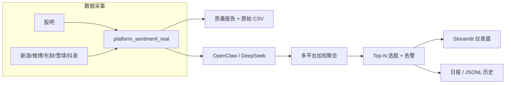

# OpenClaw AI 舆情选股系统 — 项目简介（面试版）

> **OpinionTradingWorkflow** · 适合打印 / 背诵 · 投简历与技术面自我介绍用

---

## 一句话定位

从中文社媒和财经平台采集 A 股相关舆情 → LLM 情感打分 → 多平台加权聚合 → 输出可解释的 Top-N 选股信号，并用 Streamlit 仪表盘展示。

---

## 解决什么问题

散户讨论分散在股吧、微博、雪球等平台，噪声大、难量化。本项目把**非结构化文本**变成**可追溯、可解释、可回测**的辅助信号。

**定位：投研研究原型，不是实盘交易系统。**

---

## 系统架构

```
6 平台采集 → 清洗/质检 → OpenClaw + DeepSeek 打分 → 多平台加权 → Top-N 选股 → Streamlit 展示
                ↓                              ↓
          质量报告 + CSV                  关键词兜底（降级）
```



---

## 核心模块

| 模块 | 路径 | 作用 |
|------|------|------|
| 平台采集 | `src/opinion_trading/integrations/platform_sentiment_real.py` | 6 平台 HTML 解析（股吧/新浪/微博/东财/雪球/抖音） |
| 文本质检 | `scripts/text_quality.py` | 过滤页脚模板、导航噪声，区分评论 vs 新闻 |
| WS 代理 | `openclaw_ws_proxy.py` | WebSocket → HTTP，对接 OpenClaw Gateway |
| LLM 适配 | `src/opinion_trading/core/openclaw_adapter.py` | 业务层 REST 调用，批量情感打分 |
| 分批打分 | `src/opinion_trading/core/ai_sentiment.py` | 分批调用 LLM，失败时关键词兜底 |
| 流水线 | `run_pipeline.py` | CLI：daily / realtime / backtest / evaluate |
| 仪表盘 | `src/opinion_trading/ui_dashboard.py` | Streamlit 多 Tab 展示 |
| 配置 | `config/settings.yaml` | 股票池、平台权重、多空阈值 |

---

## 仪表盘 Tab

| Tab | 内容 |
|-----|------|
| **实时选股** | Top 3 卡片、分级告警、选股原因（叙事摘要 + 平台驱动 + 正/负评论摘录） |
| **OpenClaw 实时** | AI 连接状态、分析流水、OpenClaw vs 关键词来源徽章 |
| **舆情分析** | 情感趋势、平台贡献条形图、平台情感快照 |
| **评论依据** | 正/负评论原文（多日合并、去重、带来源标签） |
| **回测评估** | 信号准确率、Sharpe-like、月度训练 |

---

## 技术栈

| 方向 | 技术 |
|------|------|
| 语言 | Python 3.12 |
| 采集与解析 | requests、BeautifulSoup、自定义多平台适配 |
| AI | OpenClaw Gateway、DeepSeek API、自研 WebSocket 代理、关键词兜底 |
| 数据 | pandas、JSONL 记忆库、按日/平台 CSV |
| 展示 | Streamlit、Altair |
| 行情 | akshare（含本地缓存回退） |
| 工程 | pytest、GitHub Actions、PowerShell 一键脚本 |

---

## 数据规模（示例，面试可说具体数字）

- 单日 raw 约 **300+ 帖**（如 `data/raw/raw_posts_2026-06-03.csv`）
- 股票池 **3 只 A 股**：600519.SH、000001.SZ、601318.SH
- OpenClaw 批量打分约 **306/321** 条为 AI 分，其余为关键词兜底
- 质量报告示例：标题/时间/正文覆盖率可达 **100%**（小样本日）

---

## 创新点（简历 / 答辩亮点）

1. **可解释舆情选股**  
   每条信号附带各平台分项得分、权重与正/负评论原文；「评论依据」Tab 形成证据链。

2. **LLM 与规则双轨降级**  
   OpenClaw + DeepSeek 为主路径；API 不可用或超时时自动走关键词情感，`score_source` 字段 + UI 徽章溯源。

3. **自研网关适配层**  
   业务只调 REST `/api/v1/sentiment`；底层 WebSocket 代理对接 OpenClaw，换模型（Ollama → DeepSeek）不改业务代码。

4. **数据质量闭环**  
   自动生成质量报告（覆盖率、噪声率、平台 fallback）；原始帖按平台落盘，支持增量 `rescore`。

5. **面向中文社媒的文本治理**  
   针对东财/股吧页脚、ICP、导航文案等设计 boilerplate 过滤，降低「全是新闻不是评论」的失真。

6. **工程化交付**  
   Stub 无 API 演示 + 真实 LLM 双模式；Windows 一键脚本 + pytest；`OPENCLAW_SKIP_ROW_SCORE` 控制 LLM 调用成本。

---

## 已知不足（面试主动说，显思考深度）

| 不足 | 说明 |
|------|------|
| 样本与标的规模小 | 仅 3 只样板股，历史天数有限，统计意义不足 |
| 数据源不稳定 | 部分平台反爬、页面改版，存在 fallback 行 |
| LLM 成本高、延迟大 | DeepSeek 单次常需 25–35s；代理超时曾导致 502 |
| ML 基线薄弱 | TF-IDF + LinearSVC 已搭，人工标注样本量小 |
| 合规未产品化 | 爬虫合规、脱敏、投资建议免责停留在学习层面 |
| 回测简化 | 未充分考虑滑点、涨跌停、幸存者偏差 |
| 部署偏本地 | 多进程本机运行，无容器化 / 调度 / 高可用 |

---

## 30 秒口述稿（背这个）

> 这是一个 A 股舆情投研原型。我从股吧、新浪、微博、东财、雪球、抖音等 6 个平台采集与股票相关的帖子，通过 OpenClaw 接 DeepSeek 做情感分析，再按平台权重聚合成 Top-N 选股，在 Streamlit 里展示每条推荐的平台分项和评论证据。  
> 创新点是**可解释**和**可降级**——LLM 不可用时关键词兜底，系统仍能演示。  
> 局限是标的少、爬虫不稳、LLM 慢，所以只作研究原型，不声称能实盘。

---

## 快速运行（演示用）

```powershell
# 仅看 UI（用已有 data/reports、data/raw）
streamlit run src/opinion_trading/ui_dashboard.py --server.port 8501
# 浏览器：http://localhost:8501

# 完整 AI 流程（可选）
powershell -ExecutionPolicy Bypass -File .\scripts\restart_openclaw_deepseek.ps1
$env:OPENCLAW_URL = "http://127.0.0.1:18790"
python run_pipeline.py --mode realtime --iterations 1 --top-n 3
```

---

## 简历经历描述（优化版 v2）

**OpenClaw AI 舆情选股系统**｜个人独立开发｜2026.03 – 2026.06

**项目背景**：针对 A 股社媒舆情分散、噪声高、难形成可交易信号的痛点，设计多源舆情因子选股与回测验证链路，将非结构化文本转化为可解释、可检验的辅助选股能力。

**技术栈**：Python 3.12｜requests / BeautifulSoup｜pandas / NumPy｜OpenClaw Gateway + DeepSeek API｜FastAPI WS 代理｜pytest + GitHub Actions｜akshare｜Streamlit / Altair

**核心成果**：
1. **设计**多平台加权舆情因子与选股规则：在 5 只 A 股样本池（茅台/五粮液/平安银行/中国平安/招商银行）上，按平台权重聚合情绪分，并以「≥2 平台共振 + 多空阈值 + 反转增量」触发买卖信号；配套年化收益、夏普比率、最大回撤、T+1 方向准确率/胜率，以及 Spearman/Pearson 信号-收益相关（类 IC）与 3 折 Walk-Forward（60/20 日）样本外检验，明确信号有效性边界。
2. **构建**覆盖股吧/投资社区、财经门户、财经新闻、微博社媒、短视频 6 类源的采集与数据治理体系：按证券代码绑定帖文至标的，完成 boilerplate/噪声过滤与评论-资讯分流；以字段完备率（标题≥95%、时间≥90%、正文≥85%）、噪声率（≤20%）、fallback 率（≤35%）做质量门控，单日处理 300+ 条原始帖并按平台分区落盘，提升可用数据密度。
3. **实现** LLM API 网关与双轨融合打分：自研 WebSocket→HTTP 代理对接 OpenClaw/DeepSeek，对外提供 REST 批量情感接口与健康探针；采用结构化 Prompt（强制 JSON schema 输出）与任务模板编排，主路径 LLM 失败时按 OpenClaw→本地模型→关键词词典顺序降级，并用 `score_source` 溯源；情绪分再与技术/基本面 Agent 按 0.4/0.35/0.25 加权共识，辅以 24h 半衰期时效加权。
4. **落地**可运行的流水线工程架构：ThreadPool 并行采集、HTML 磁盘缓存与请求限速（≥1.5s）控成本；实时评分变动分级告警并可推送钉钉/企微/Telegram；Stub/真实双模式保障链路可用；120+ pytest + GitHub Actions（含 fast-daily smoke）支撑回归，投研看板仅作结果呈现层。

---

*文档版本：与 README 及仓库结构同步 · 个人学习 / 求职展示用途 · 表述对齐已实现能力，未虚构 ICIR/超额业绩与未实现 NLP 模块*
